<!-- Improved compatibility of back to top link: See: https://github.com/othneildrew/Best-README-Template/pull/73 -->
<a id="readme-top"></a>

<!-- PROJECT SHIELDS -->
<!--
*** I'm using markdown "reference style" links for readability.
*** Reference links are enclosed in brackets [ ] instead of parentheses ( ).
*** See the bottom of this document for the declaration of the reference variables
*** for contributors-url, forks-url, etc. This is an optional, concise syntax you may use.
*** https://www.markdownguide.org/basic-syntax/#reference-style-links
-->

<div align="center">

[![Contributors][contributors-shield]][contributors-url]
[![Forks][forks-shield]][forks-url]
[![Stargazers][stars-shield]][stars-url]
[![Issues][issues-shield]][issues-url]
[![MIT License][license-shield]][license-url]
[![LinkedIn][linkedin-shield]][linkedin-url]

</div>

<!-- PROJECT LOGO -->
<br />
<div align="center">
  <a href="https://github.com/devxtra-community/hayon">
    
  </a>

  <h1 align="center"> Hayon</h1>

  <p align="center">
    <strong>The Ultimate Social Media Auto-Poster Platform</strong>
    <br />
    <em>Create, Schedule & Publish — All From One Place</em>
    <br />
    <br />
    <a href="https://github.com/devxtra-community/hayon"><strong>📚 Explore the docs »</strong></a>
    <br />
    <br />
    <a href="https://hayon.site">🌐 View Demo</a>
    ·
    <a href="https://github.com/devxtra-community/hayon/issues/new?labels=bug&template=bug-report---.md">🐛 Report Bug</a>
    ·
    <a href="https://github.com/devxtra-community/hayon/issues/new?labels=enhancement&template=feature-request---.md">✨ Request Feature</a>
  </p>
</div>

<!-- BADGES -->
<div align="center">


</div>

<br />

<!-- TABLE OF CONTENTS -->
<details>
  <summary>📋 Table of Contents</summary>
  <ol>
    <li>
      <a href="#-about-the-project">About The Project</a>
      <ul>
        <li><a href="#-key-features">Key Features</a></li>
        <li><a href="#️-built-with">Built With</a></li>
      </ul>
    </li>
    <li>
      <a href="#-getting-started">Getting Started</a>
      <ul>
        <li><a href="#-prerequisites">Prerequisites</a></li>
        <li><a href="#-backend-setup">Backend Setup</a></li>
        <li><a href="#-frontend-setup">Frontend Setup</a></li>
      </ul>
    </li>
    <li><a href="#%EF%B8%8F-architecture">Architecture</a></li>
    <li><a href="#-repository-structure">Repository Structure</a></li>
    <li><a href="#-branch-strategy">Branch Strategy</a></li>
    <li><a href="#-system-flow">System Flow</a></li>
    <li><a href="#️-roadmap">Roadmap</a></li>
    <li><a href="#-contributing">Contributing</a></li>
    <li><a href="#-license">License</a></li>
    <li><a href="#-contact">Contact</a></li>
    <li><a href="#-acknowledgments">Acknowledgments</a></li>
  </ol>
</details>

<br />

---

<!-- ABOUT THE PROJECT -->
## 🌟 About The Project

<div align="center">
  <a href="https://hayon.vercel.app">
    
  </a>
</div>

<br />

**Hayon** is a **production-ready, full-stack social media automation platform** designed to solve one critical problem:

> 🎯 **Managing and publishing content across multiple social media platforms from a single, unified dashboard.**

Whether you're a social media manager, content creator, or marketing team, Hayon streamlines your workflow by providing intelligent scheduling, AI-powered captions, and comprehensive analytics — all in one place.

### 💡 Why Hayon?

- ⏰ **Save Time** — Schedule posts once, publish everywhere
- 🤖 **AI-Powered** — Generate platform-specific captions automatically
- 📊 **Data-Driven** — Track performance with detailed analytics
- 🔔 **Stay Informed** — Real-time notifications for post status
- 💳 **Monetization Ready** — Built-in subscription and payment handling
- 🛡️ **Enterprise Grade** — Robust admin controls and user management

<p align="right">(<a href="#readme-top">back to top</a>)</p>

---

### 🔑 Key Features

<table>
  <tr>
    <td align="center" width="33%">
      
      <br />
      <strong>Multi-Platform Publishing</strong>
      <br />
      <sub>Post to multiple social networks simultaneously</sub>
    </td>
    <td align="center" width="33%">
      
      <br />
      <strong>AI-Generated Captions</strong>
      <br />
      <sub>Smart, platform-specific content suggestions</sub>
    </td>
    <td align="center" width="33%">
      
      <br />
      <strong>Smart Scheduling</strong>
      <br />
      <sub>Schedule posts for optimal engagement times</sub>
    </td>
  </tr>
  <tr>
    <td align="center" width="33%">
      
      <br />
      <strong>Rich Analytics</strong>
      <br />
      <sub>Comprehensive insights and usage tracking</sub>
    </td>
    <td align="center" width="33%">
      
      <br />
      <strong>Real-time Notifications</strong>
      <br />
      <sub>Instant alerts for post success or failure</sub>
    </td>
    <td align="center" width="33%">
      
      <br />
      <strong>Subscription Management</strong>
      <br />
      <sub>Integrated payment and billing with Stripe</sub>
    </td>
  </tr>
</table>

<p align="right">(<a href="#readme-top">back to top</a>)</p>

---

### 🛠️ Built With

This project leverages a modern, scalable tech stack:

<table>
  <tr>
    <th align="center">Frontend</th>
    <th align="center">Backend</th>
    <th align="center">Infrastructure</th>
    <th align="center">Deployment</th>
  </tr>
  <tr>
    <td>
       Next.js (App Router)<br/>
       Tailwind CSS<br/>
       TypeScript<br/>
       Recharts<br/>
       shadcn/ui
    </td>
    <td>
       Node.js<br/>
       Express<br/>
       MongoDB<br/>
       JWT +  Google OAuth<br/>
       TypeScript
    </td>
    <td>
       Redis<br/>
       RabbitMQ<br/>
       AWS S3<br/>
       Stripe<br/>
       Google Gemini AI
    </td>
    <td>
       Vercel (Frontend)<br/>
       AWS EC2 (Backend)
    </td>
  </tr>
</table>

<p align="right">(<a href="#readme-top">back to top</a>)</p>

---

<!-- GETTING STARTED -->
## 🚀 Getting Started

This project is a **monorepo** containing both frontend and backend. They run independently but share the same repository.

### 📋 Prerequisites

Ensure you have the following installed:

* **Node.js** v18 or higher
  ```sh
  node --version
  ```
* **npm** (latest version recommended)
  ```sh
  npm install npm@latest -g
  ```
* **MongoDB** (local or [MongoDB Atlas](https://www.mongodb.com/atlas))
* **Redis** ([Download](https://redis.io/download))
* **RabbitMQ** ([Download](https://www.rabbitmq.com/download.html))

> ⚠️ **Important:** If Redis or RabbitMQ are not running, background jobs will fail. That's expected behavior.

<p align="right">(<a href="#readme-top">back to top</a>)</p>

---

### 🔧 Backend Setup

1. **Navigate to backend directory**
   ```sh
   cd backend
   ```

2. **Install dependencies**
   ```sh
   npm install
   ```

3. **Configure environment variables**
   
   Create a `.env` file in `backend/`:
   ```env
   NODE_ENV=development
   PORT=4000
   
   # Database
   MONGO_URI=mongodb://localhost:27017/hayon
   
   # JWT Configuration
   JWT_SECRET=your-super-secret-key
   JWT_EXPIRES_IN=7d
   
   # Google OAuth
   GOOGLE_CLIENT_ID=your-google-client-id
   GOOGLE_CLIENT_SECRET=your-google-client-secret
   
   # Redis
   REDIS_URL=redis://localhost:6379
   
   # RabbitMQ
   RABBITMQ_URL=amqp://localhost:5672
   
   # AWS S3
   AWS_ACCESS_KEY_ID=your-access-key
   AWS_SECRET_ACCESS_KEY=your-secret-key
   AWS_REGION=your-region
   AWS_S3_BUCKET=your-bucket-name
   
   # Stripe
   STRIPE_SECRET_KEY=sk_test_xxx
   STRIPE_WEBHOOK_SECRET=whsec_xxx
   
   # AI
   GEMINI_API_KEY=your-gemini-api-key
   ```

4. **Start the backend server**
   ```sh
   npm run dev
   ```

   🎉 Backend runs on: **http://localhost:4000**

<p align="right">(<a href="#readme-top">back to top</a>)</p>

---

### 🎨 Frontend Setup

1. **Navigate to frontend directory**
   ```sh
   cd frontend
   ```

2. **Install dependencies**
   ```sh
   npm install
   ```

3. **Configure environment variables**
   
   Create a `.env.local` file in `frontend/`:
   ```env
   NEXT_PUBLIC_API_BASE_URL=http://localhost:4000
   NEXT_PUBLIC_GOOGLE_CLIENT_ID=your-google-client-id
   ```

4. **Start the frontend server**
   ```sh
   npm run dev
   ```

   🎉 Frontend runs on: **http://localhost:3000**

<p align="right">(<a href="#readme-top">back to top</a>)</p>

---

<!-- ARCHITECTURE -->
## 🏗️ Architecture

```mermaid
graph TB
    subgraph Client
        A[Next.js Frontend]
    end
    
    subgraph Reverse Proxy
        N[🔀 Nginx]
    end
    
    subgraph Backend
        B[Express API Server]
        C[Background Workers]
    end
    
    subgraph Services
        D[(MongoDB)]
        E[(Redis)]
        F[RabbitMQ]
    end
    
    subgraph External
        G[AWS S3]
        H[Stripe]
        I[Google Gemini]
        J[Social APIs]
    end
    
    A -->|HTTP/REST| N
    N --> B
    B --> D
    B --> E
    B --> F
    B --> G
    B --> H
    B --> I
    F --> C
    C --> J
```



<p align="right">(<a href="#readme-top">back to top</a>)</p>

---

<!-- REPOSITORY STRUCTURE -->
## 📁 Repository Structure

```
hayon/
├── 📂 frontend/
│   ├── 📂 src/
│   │   ├── 📂 app/            # Next.js App Router (pages, layouts)
│   │   ├── 📂 components/     # Reusable UI components
│   │   ├── 📂 assets/         # Static assets
│   │   └── 📂 lib/            # Utilities and helpers
│   ├── 📂 public/             # Public static files
│   ├── 📄 package.json
│   ├── 📄 .env.local
│   └── 📄 prettier.config.js
│
├── 📂 backend/
│   ├── 📂 src/
│   │   ├── 📂 config/         # Configuration files
│   │   ├── 📂 controllers/    # Route handlers
│   │   ├── 📂 routes/         # API route definitions
│   │   ├── 📂 models/         # MongoDB schemas
│   │   ├── 📂 repositories/   # Data access layer
│   │   ├── 📂 interfaces/     # TypeScript interfaces
│   │   ├── 📂 middlewares/    # Express middlewares
│   │   ├── 📂 services/       # Business logic
│   │   ├── 📂 utils/          # Helper functions
│   │   └── 📄 app.ts          # Express app entry
│   ├── 📄 package.json
│   └── 📄 .env
│
├── 📂 images/                 # Project images and screenshots
├── 📂 docs/                   # Documentation
└── 📄 README.md
```

> 📝 **Note:** There is no shared runtime code between frontend and backend. Communication happens strictly via HTTP APIs.

<p align="right">(<a href="#readme-top">back to top</a>)</p>

---

<!-- BRANCH STRATEGY -->
## 🌿 Branch Strategy

This repository follows a **three-branch strategy** for safe, organized deployments:

<table>
  <tr>
    <th>Branch</th>
    <th>Purpose</th>
    <th>Rules</th>
  </tr>
  <tr>
    <td><code>🔵 main</code></td>
    <td>Production</td>
    <td>✅ Always stable<br/>❌ No direct commits<br/>🚀 Deployed to live</td>
  </tr>
  <tr>
    <td><code>🟡 staging</code></td>
    <td>Pre-production</td>
    <td>🧪 QA and testing<br/>🪞 Mirrors production</td>
  </tr>
  <tr>
    <td><code>🟢 dev</code></td>
    <td>Active development</td>
    <td>🔀 All features merge here first</td>
  </tr>
</table>

### Feature Branch Naming

```
feature/ai-captions
feature/post-scheduler
feature/stripe-integration
fix/auth-token-refresh
hotfix/critical-bug
```

### Merge Flow

```
feature/* → dev → staging → main
```

> ⚠️ **Skipping branches is how bugs reach production.**

<p align="right">(<a href="#readme-top">back to top</a>)</p>

---

<!-- SYSTEM FLOW -->
## 🔄 System Flow

<div align="center">


</div>

<p align="right">(<a href="#readme-top">back to top</a>)</p>

---

<!-- ROADMAP -->
## 🗺️ Roadmap

- [x] ✅ Multi-platform post publishing
- [x] ✅ AI-generated captions
- [x] ✅ Background job processing
- [x] ✅ Stripe integration
- [x] ✅ Analytics dashboard
- [ ] 📱 Mobile app (React Native)
- [ ] 📊 Advanced analytics with AI insights
- [ ] 🌍 Multi-language support
    - [ ] Spanish
    - [ ] French
    - [ ] Arabic
- [ ] 🔌 More social platform integrations
- [ ] 📹 Video post support
- [ ] 🤝 Team collaboration features

See the [open issues](https://github.com/devxtra-community/hayon/issues) for a full list of proposed features and known issues.

<p align="right">(<a href="#readme-top">back to top</a>)</p>

---

<!-- CONTRIBUTING -->
## 🤝 Contributing

Contributions are what make the open source community such an amazing place to learn, inspire, and create. Any contributions you make are **greatly appreciated**!

If you have a suggestion that would make this better, please fork the repo and create a pull request. You can also simply open an issue with the tag "enhancement".

**Don't forget to give the project a ⭐!**

### How to Contribute

1. **Fork the Project**
2. **Create your Feature Branch**
   ```sh
   git checkout -b feature/AmazingFeature
   ```
3. **Commit your Changes**
   ```sh
   git commit -m 'Add some AmazingFeature'
   ```
4. **Push to the Branch**
   ```sh
   git push origin feature/AmazingFeature
   ```
5. **Open a Pull Request**

### Contribution Rules

| ✅ Do | ❌ Don't |
|-------|----------|
| Create feature branches from `dev` | Commit directly to `main` |
| Keep frontend/backend changes separate | Make "quick fixes" bypassing `staging` |
| Test thoroughly before merging | Skip testing for auth/payment logic |
| Write descriptive commit messages | Use vague commit messages |

### 🏆 Top Contributors

<a href="https://github.com/devxtra-community/hayon/graphs/contributors">
  
</a>

<p align="right">(<a href="#readme-top">back to top</a>)</p>

---

<!-- LICENSE -->
## 📄 License

This project is **Private / Internal** and is not intended for public redistribution.

See `LICENSE` for more information.

<p align="right">(<a href="#readme-top">back to top</a>)</p>

---

<!-- CONTACT -->
## 📬 Contact

**Hayon Team** - [@hayonhq](https://twitter.com/hayonhq) - hello@hayon.dev

**Project Link:** [https://github.com/devxtra-community/hayon](https://github.com/devxtra-community/hayon)

<p align="right">(<a href="#readme-top">back to top</a>)</p>

---

<!-- ACKNOWLEDGMENTS -->
## 🙏 Acknowledgments

Resources and tools that made this project possible:

* [Next.js](https://nextjs.org/) - The React Framework
* [Tailwind CSS](https://tailwindcss.com/) - Utility-first CSS framework
* [shadcn/ui](https://ui.shadcn.com/) - Beautiful UI components
* [MongoDB](https://www.mongodb.com/) - Document database
* [Stripe](https://stripe.com/) - Payment infrastructure
* [Google Gemini](https://ai.google.dev/) - AI capabilities
* [Img Shields](https://shields.io) - Badges for README
* [Lucide Icons](https://lucide.dev/) - Beautiful icons
* [Best-README-Template](https://github.com/othneildrew/Best-README-Template) - README inspiration

<p align="right">(<a href="#readme-top">back to top</a>)</p>

---

<div align="center">
  <strong>Built with ❤️ by the Hayon Team</strong>
  <br /><br />
  <a href="https://github.com/devxtra-community/hayon">
    
  </a>
  <br /><br />
  <sub>© 2025 Hayon. All Rights Reserved.</sub>
</div>

<!-- MARKDOWN LINKS & IMAGES -->
[contributors-shield]: https://img.shields.io/github/contributors/devxtra-community/hayon.svg?style=for-the-badge
[contributors-url]: https://github.com/devxtra-community/hayon/graphs/contributors
[forks-shield]: https://img.shields.io/github/forks/devxtra-community/hayon.svg?style=for-the-badge
[forks-url]: https://github.com/devxtra-community/hayon/network/members
[stars-shield]: https://img.shields.io/github/stars/devxtra-community/hayon.svg?style=for-the-badge
[stars-url]: https://github.com/devxtra-community/hayon/stargazers
[issues-shield]: https://img.shields.io/github/issues/devxtra-community/hayon.svg?style=for-the-badge
[issues-url]: https://github.com/devxtra-community/hayon/issues
[license-shield]: https://img.shields.io/github/license/devxtra-community/hayon.svg?style=for-the-badge
[license-url]: https://github.com/devxtra-community/hayon/blob/master/LICENSE
[linkedin-shield]: https://img.shields.io/badge/-LinkedIn-black.svg?style=for-the-badge&logo=linkedin&colorB=555
[linkedin-url]: https://linkedin.com/in/hayon