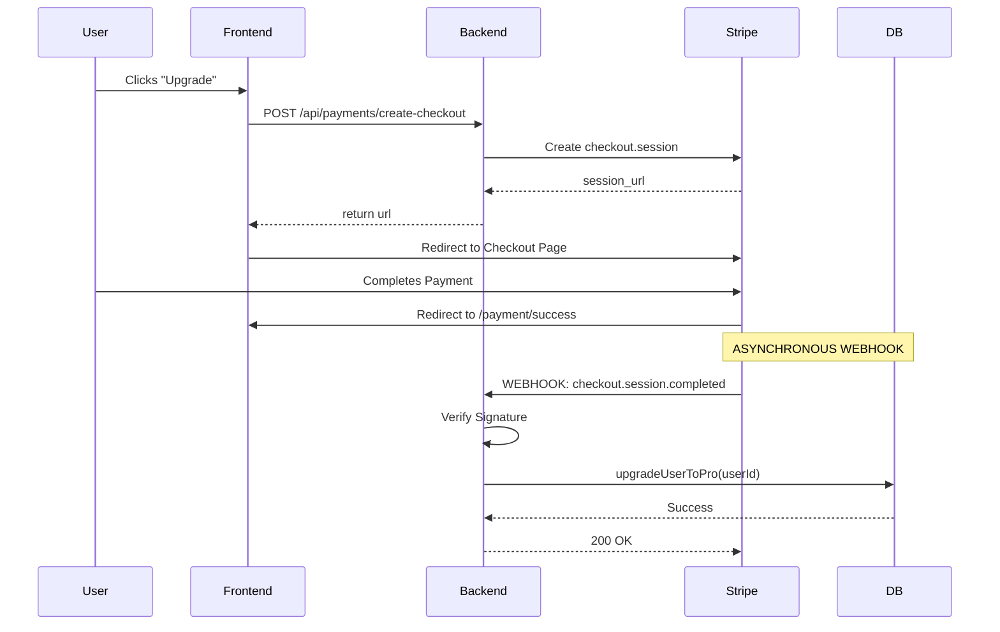

# Stripe & Subscription System - Complete Masterclass

A comprehensive guide to understanding how Hayon handles payments, plan-based limits, and the automated subscription lifecycle.

---

## Table of Contents
1. [The Big Picture](#1-the-big-picture)
2. [Data Architecture](#2-data-architecture)
3. [The Stripe Lifecycle (Webhooks)](#3-the-stripe-lifecycle)
4. [Backend Deep Dive](#4-backend-deep-dive)
5. [Frontend Deep Dive](#5-frontend-deep-dive)
6. [Security & Verification](#6-security--verification)
7. [Edge Cases & Error Handling](#7-edge-cases--error-handling)

---

## 1. The Big Picture

Hayon uses a **"Source of Truth"** model for subscriptions. Stripe holds the money and the status, but the Hayon database holds the **limits** and **permissions**.

### Architecture Overview



### Key Components
- **Stripe Checkout**: Handles secure card collection.
- **Stripe Webhooks**: The "secret bridge" that tells our backend when money moves.
- **UserRepository**: Atomic operations to ensure users never get stuck in a "half-upgraded" state.
- **LimitMiddleware**: The bouncer that checks usage vs limits on every protected action.

---

## 2. Data Architecture

### Plans Configuration (`backend/src/config/plans.ts`)
We centralize limits in one place. This prevents "magic numbers" from being scattered across the codebase.

```typescript
export const PLAN_LIMITS = {
  free: {
    maxPosts: 30,
    maxCaptionGenerations: 50,
  },
  pro: {
    maxPosts: 100,
    maxCaptionGenerations: 100,
  },
} as const;
```

### User Schema (`user.model.ts`)
The user document stores everything needed for local limit calculation.

```typescript
subscription: {
  plan: { type: String, enum: ["free", "pro"], default: "free" },
  status: { type: String, enum: ["active", "pastDue", "canceled"], default: "active" },
  stripeCustomerId: String,
  stripeSubscriptionId: String,
  currentPeriodStart: Date,
  currentPeriodEnd: Date,
  cancelAtPeriodEnd: Boolean
},
limits: {
  maxPosts: { type: Number, default: 30 },
  maxCaptionGenerations: { type: Number, default: 50 }
},
usage: {
  postsCreated: { type: Number, default: 0 },
  captionGenerations: { type: Number, default: 0 }
}
```

---

## 3. The Stripe Lifecycle (Webhooks)

Webhooks are events sent from Stripe to our server. We handle 5 critical events in `payment.service.ts`:

| Event | Logic | Result |
|-------|-------|--------|
| `checkout.session.completed` | Main upgrade event. | User becomes Pro, limits set to 100, usage resets to 0. |
| `invoice.payment_succeeded` | Monthly auto-renewal. | Updates `currentPeriodEnd` and **resets usage counters** for the new month. |
| `invoice.payment_failed` | Card declined on renewal. | Sets status to `pastDue`. User still has access but sees a warning banner. |
| `customer.subscription.deleted`| Access period ended. | User downgraded to Free, limits set to 30. |
| `customer.subscription.updated`| Portal interaction. | Syncs the `cancelAtPeriodEnd` flag if user toggles it in Stripe portal. |

---

## 4. Backend Deep Dive

### The Atomic Upgrade (`user.repository.ts`)
When a user pays, we MUST update everything at once. We use `$set` in MongoDB to ensure consistency.

```typescript
export const upgradeUserToPro = async (userId: string, data: any) => {
  return User.findByIdAndUpdate(userId, {
    $set: {
      "subscription.plan": "pro",
      "subscription.status": "active",
      "subscription.stripeCustomerId": data.stripeCustomerId,
      "subscription.stripeSubscriptionId": data.stripeSubscriptionId,
      "subscription.currentPeriodStart": data.currentPeriodStart,
      "subscription.currentPeriodEnd": data.currentPeriodEnd,
      "subscription.cancelAtPeriodEnd": false,
      "limits.maxPosts": PLAN_LIMITS.pro.maxPosts,
      "limits.maxCaptionGenerations": PLAN_LIMITS.pro.maxCaptionGenerations,
      "usage.postsCreated": 0, // Reset usage for fresh start
      "usage.captionGenerations": 0,
    },
  });
};
```

### The Webhook Brain (`payment.service.ts`)
This function validates that the event actually came from Stripe and dispatches it.

```typescript
export const handleWebhookEvent = async (rawBody: Buffer, signature: string) => {
  // CRITICAL: verify the signature using the RAW body
  const event = stripe.webhooks.constructEvent(
    rawBody, 
    signature, 
    ENV.STRIPE.WEBHOOK_SECRET
  );

  switch (event.type) {
    case "checkout.session.completed":
      const userId = event.data.object.metadata.userId; // We linked the ID during checkout!
      await handleCheckoutCompleted(userId, event.data.object);
      break;
    // ... other cases
  }
};
```

---

## 5. Frontend Deep Dive

### React PlanInfoCard (`PlanInfoCard.tsx`)
This component is highly dynamic. It calculates "Percentage Used" and handles UI states.

#### Logical Decision: The 90% Rule
We added a "warning" state for usage bars. When a user reaches 90% of their limit, the bar turns red.

```tsx
const percentage = (used / limit) * 100;
const isHighUsage = percentage >= 90;

<div className={`h-full ${isHighUsage ? "bg-red-500" : "bg-[#318D62]"}`} />
```

#### The Manage Billing Flow
Instead of building our own "Update Credit Card" page, we redirect to Stripe's native billing portal. This saves weeks of development and is more secure.

```typescript
const handleBillingPortal = async () => {
  const url = await paymentService.getBillingPortal();
  window.location.href = url; // No custom UI needed!
};
```

---

## 6. Security & Verification

### Webhook Signature Verification
**Problem**: Anyone can send a POST request to `/api/payments/webhook` pretending to be Stripe.
**Solution**: Stripe signs every request with a secret key. We use `stripe.webhooks.constructEvent()` to verify this.

### Raw Body Parsing (`app.ts`)
Express's `express.json()` middleware "destroys" the original raw string of the request by parsing it into an object. However, Stripe verification **requires** the original raw string.

We fixed this by mounting the webhook route **before** global JSON parsing:
```typescript
// app.ts
expressInstance.use("/api/payments/webhook", express.raw({ type: "application/json" }));
expressInstance.use(express.json()); // Global JSON parsing comes AFTER
```

---

## 7. Edge Cases & Error Handling

### Edge Case: User cancels, then changes mind
If a user schedules cancellation (`cancelAtPeriodEnd = true`), they keep Pro access until the date expires. We show a special "Access Until" banner. If they want to resume, they can do so via the Stripe Billing Portal, and our `customer.subscription.updated` webhook will automatically sync it back.

### Edge Case: Payment Failure (Past Due)
If a monthly renewal fails (e.g., expired card), we don't instantly kick them out. We set status to `pastDue`. Our `PlanInfoCard` detects this and shows a red warning banner with a direct link to "Update Payment Method".

### Edge Case: Multiple Clicks
What if a user clicks "Upgrade" twice? We create two checkout sessions, but since we handle the final upgrade logic in the webhook based on the `userId`, the second payment would simply "overwrite" the same user record with the newest Stripe IDs, causing no data corruption.

---

### Logical Summary
1.  **Backend** is the Enforcer (Middleware).
2.  **Stripe** is the Auditor (Money/Status).
3.  **Frontend** is the Informer (Banners/Usage Bars).

**You now have a production-grade subscription engine!** 🚀
